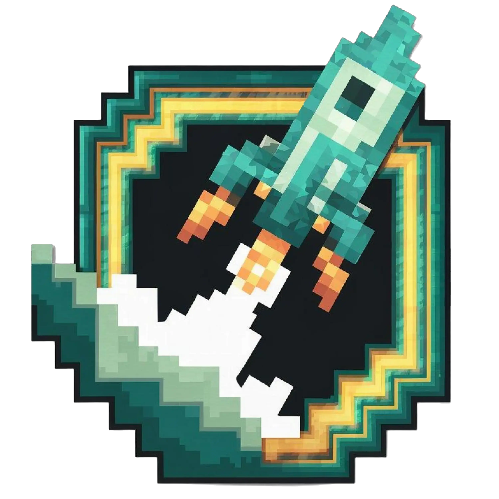

  
  <h2 align="center">RocketMC Launcher</h2>
  
An open-source Minecraft launcher for Windows , Linux and MacOS.

    
    
    
    

 

RocketMC is a Minecraft launcher based on OpenLauncher, providing a simple and fast way to launch Minecraft. It supports multiple versions and works with both modded and vanilla Minecraft.

⚡ Features

Launch different Minecraft versions easily

Lightweight and fast

Supports modded and vanilla Minecraft

RocketMC is based on OpenLauncher, originally created by CesarGarza55
. Huge thanks to them for the launcher and the logo used in this project.

The name RocketMC was inspired by ONE from the Blake Discord server ( he didn't ask to be credited but he's not gonnna sue me if I did ONE you don't have the guts to sue me bro).

